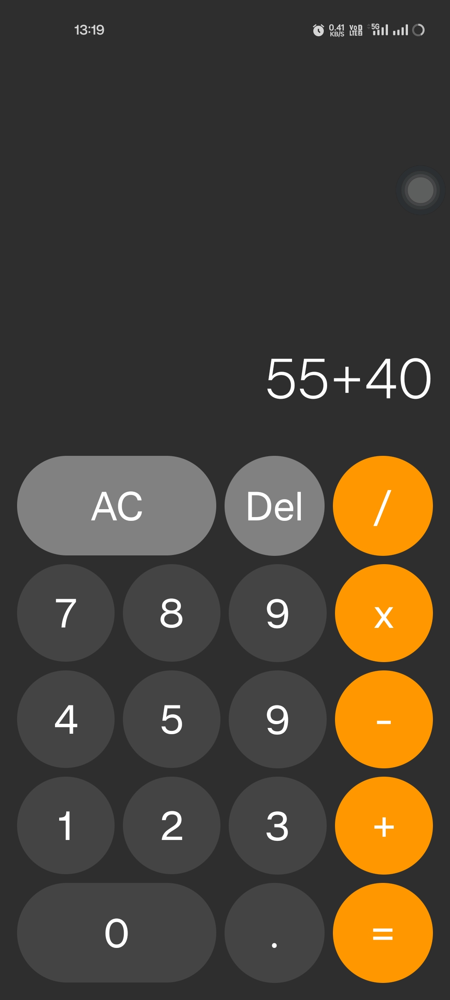

# 🧮 SimpleCalc-Kotlin

A simple calculator app built using **Kotlin** and **Jetpack Compose**. This lightweight app performs basic arithmetic operations with a user-friendly interface.  

## ✨ Features  
✔️ Addition, Subtraction, Multiplication, and Division  
✔️ Clean and minimal UI with Jetpack Compose  

## 🚀 Getting Started  

### Prerequisites  
- Android Studio (latest version)  
- Kotlin and Jetpack Compose support enabled  

### Installation  
1. Clone this repository:  
   git clone https://github.com/abbasdx/SimpleCalc-Kotlin.git
2. Open in **Android Studio**  
3. Run the app on an **emulator** or **physical device**  

## 🛠️ Technologies Used  
- **Kotlin**  
- **Jetpack Compose**  
- **Android Studio**  

## 📸 Screenshots  

## 📌 Future Enhancements  
🔹 Implement history feature for calculations  
🔹 Improve UI animations  

## 📝 License  
This project is open-source under the **MIT License**.  

---
  
👨‍💻 Developed by **Abbas Ansari**  
🚀 Happy Coding!  
